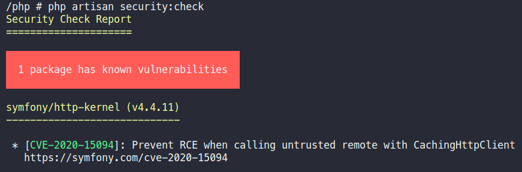

# Laravel Security Checker

Integrate [sensiolabs/security-checker](https://github.com/sensiolabs/security-checker) to your Laravel project.

Add a command to check the project dependencies in `composer.lock` against the [Symfony Security Advisories Database](https://security.symfony.com/)

## Installation

Using composer:

```sh
composer require sun-asterisk/laravel-security-checker
```

For Laravel 5.4 and earlier, add the service provider to your config/app.php.

```php
'providers' => [
    // ...
    SunAsterisk\LaravelSecurityChecker\ServiceProvider::class
    // ...
];
```

## Usage

The security checker is provided as an Artisan command

```sh
php artisan security:check
```



The command exit with status code 1 if vulnerabilities are found so you can use it in your CI pipeline.

### Writing report to file

In addition to printing vulnerable packages, you can generate a report file. JSON & JUnit format report are supported.

Generate a JSON report:

```sh
php artisan security:check --report-json=security-check.json
```

Generate a JUnit report:

```sh
php artisan security:check --report-junit=security-check.xml
```
